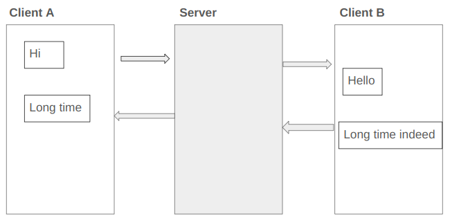

### Q4. Socket Programming

We are interested in achieving a chatting system whereby we have two clients and one server that stands between those clients. The clients are used to receive and send data while the server will be receiving data and forward them to the right client. Each client will be receiving data and send data.

You are required to implement the chat system.